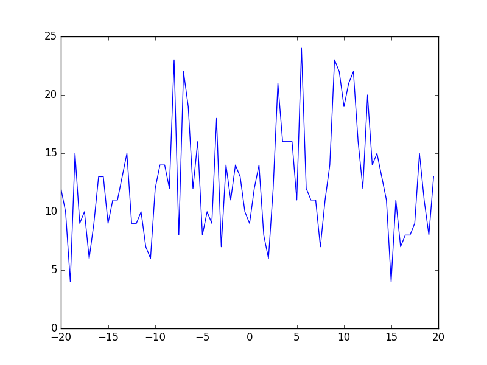

## Understanding the Files the incomplete files

dump_15_20 is 20,000 timesteps for B = 60 and A = -22.5 ~ although we don't know what step this is at

dump_15_xx is 40,000 timesteps for B = 60 and A = -22.5 ~ although we don't what step this is at

## Discussion

These images contain analysis over two dimensions, the first is the value of **A**

Images mXX_60.png are run over 10k steps, we see a movement from liquid like to gas like behaviour even at these short time scales.

At **A** == -30: 

At **A** == -20:

This is well and good to start, but things get more complicated as we approach the boundary. Specifically in this example the images produce for **A** == -22.5 is problematic.

The first thing to note is that one value is 0. This prevents calculations of the the form ** max*f > min ** working, however this can be worked around. The underlying physics is more interesting and can be seen by expanding the number of timesteps.

## Extending the timestep

_underway_

