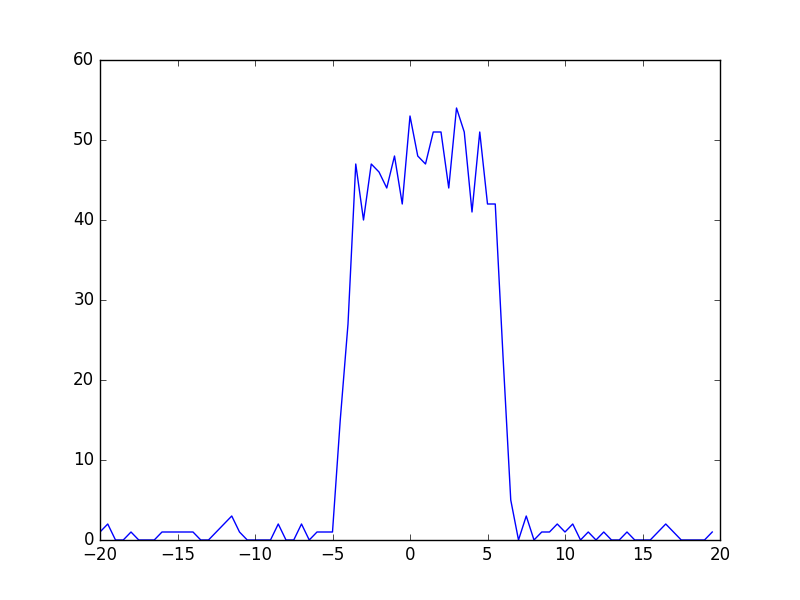
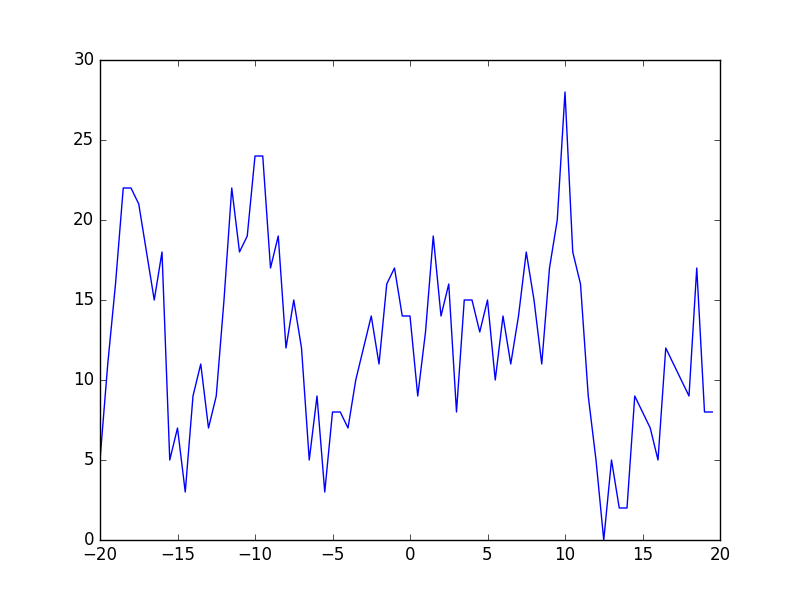
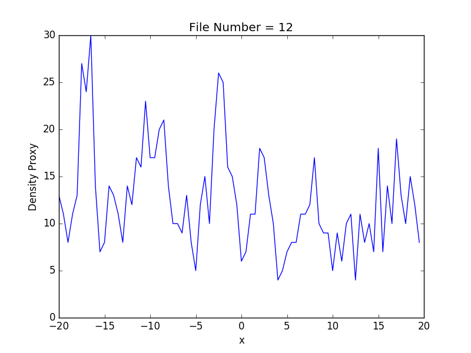
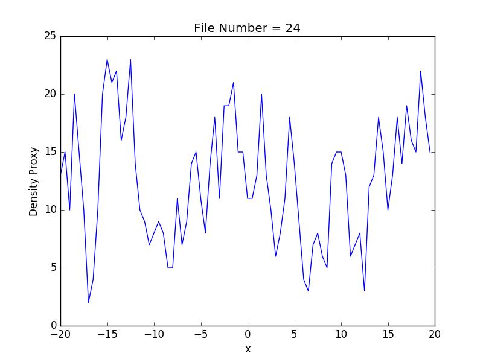

## Skip to Discussion 

dump_15_20 is 20,000 timesteps for B = 60 and A = -22.5 ~ although we don't know what step this is at

dump_15_xx is 40,000 timesteps for B = 60 and A = -22.5 ~ although we don't what step this is at

## Discussion

These images contain analysis over two dimensions, the first is the value of **A**

Images mXX_60.png are run over 10k steps, we see a movement from liquid like to gas like behaviour even at these short time scales. The axis on the bottom is x, the height is number of particles over a thin (0.5) slice. This converts to local density with division by (25*0.5).

At **A** = -30: 

At **A** = -20:

This is well and good to start, but things get more complicated as we approach the boundary. As a concrete example consider the image produced for **A** = -22.5; which can't naturally be described as either a liquid or a gas.

The first thing to note is that one value is 0. This prevents calculations of the the form **max x 0.9 > min** working, however this can be worked around. The underlying physics is more interesting and can be seen by expanding the number of timesteps.

## Extending the timestep

_still underway_

     

            
        

          

            
                   

                  

                    
                        

                          

                          

