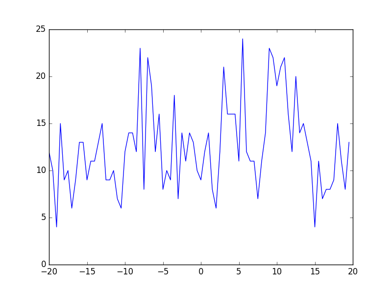
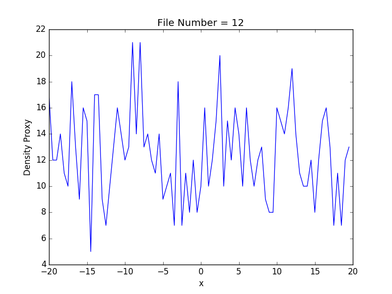

## Preliminaries

The experiments under discussion here use a timestep = 0.01 and **B** = 60. Plots are of local density (this is a particle count over a distance of 0.5 and a cross sectional area of 25) for a single frame. The distance axis (x) is given in units of the DPD length.

## Results

These images contain analysis over two dimensions (with an random initial config), the first is the value of **A**

The first set of experiments are run over 10k steps. We see a movement from liquid like to gas like behaviour even at these short time scales.

At **A** = -30: 

At **A** = -20:

This is well and good to start, but things get more complicated as we approach the boundary. As a concrete example consider the image produced for **A** = -22.5; which can't naturally be described as either a liquid or a gas.

## Extending the timestep

Below are a number of sets of three images, which reading from left to right are taken from steps=0 , steps = 250k and steps = 500k

### Working with **A** = -20

            
            
            

### Working with **A** = -22.5

            
            
            

### Working with **A** = -25

            
            
            

In the final case we instead use 0,200k and 300k (to save experimental time)

### Working with **A** = -15

            
            
            

## Zooming in on the phase transition

The above work suggests that it's reasonably difficult/slow to form a 'clean' gas phase. However if we find that the liquid phase is 'clean' (see A=-25) we may be able to use that instead. 

Hoorah! We have something we can work with (these are off 250k steps):

### A = -24

            
            
            

### A = -23

            
            
            

A phase transition!?

## Averaging over many frames

In this set of experiments we ramp up the equilbration time and reduce the trajectory significantly.
